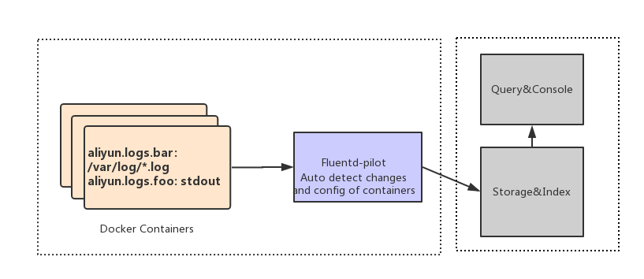

Architecture
============

On every docker host, run a fluentd-pilot instance. Fluentd-pilot will monitor docker events, parse log labels on new docker conatienr, generate appropriate fluentd configuration and notify fluentd to load the new configuration.



Run Fluentd-pilot
=================

### Start fluentd-pilot in docker container

```
docker run --rm -it \
   -v /var/run/docker.sock:/var/run/docker.sock \
   -v /:/host \
   registry.cn-hangzhou.aliyuncs.com/acs-sample/fluentd-pilot:latest
```

By default, all the logs that fluentd-pilot collect will write to fluentd-pilot's stdout. 

### Work with elastichsearch

The command below run pilot with elastichsearch output, this makes fluentd-pilot send all logs to elastichsearch.

```
docker run --rm -it \
    -v /var/run/docker.sock:/var/run/docker.sock \
    -v /:/host \
    -e FLUENTD_OUTPUT=elasticsearch \
    -e ELASTICSEARCH_HOST=${ELASTICSEARCH_HOST} \
    -e ELASTICSEARCH_PORT=${ELASTICSEARCH_PORT} \
    registry.cn-hangzhou.aliyuncs.com/acs-sample/fluentd-pilot:latest
```

### Other log management

Fluentd-pilot also support graylog2. Supports for other log managements are in progress. You are welcome to create a pull request.

Declare log configuration of docker container
=============================================

### Basic usage

```
docker run -it --rm  -p 10080:8080 \
    -v /usr/local/tomcat/logs \
    --label aliyun.logs.catalina=stdout \
    --label aliyun.logs.access=/usr/local/tomcat/logs/localhost_access_log.*.txt \
    tomcat
```

The command above runs tomcat container, expect that fluentd-pilot collect stdout of tomcat and logs in `/usr/local/tomcat/logs/localhost_access_log.\*.txt`. `-v /usr/local/tomcat/logs` is needed here so fluentd-pilot could access file in tomcat container.

### More

There are many labels you can use to describe the log info. 

- `aliyun.logs.$name=$path`
    - Name is an identify, can be any string you want. The valid characters in name are `0-9a-zA-Z_-`
    - Path is the log file path, can contians wildcard. `stdout` is a special value which means stdout of the container.
- `aliyun.logs.$name.format=none|json|csv|nginx|apache2|regexp` format of the log
    - none: pure text.
    - json: a json object per line.
    - regexp: use regex parse log. The pattern is specified by `aliyun.logs.$name.format.pattern = $regex`
- `aliyun.logs.$name.tags="k1=v1,k2=v2"`: tags will be appended to log. 

